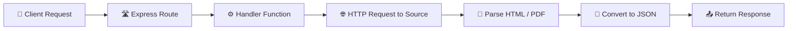

# WiP: Wilma Plus Food Menu API

This API provides additional food menus which are not available as JSON.  
This middleware parses HTML or PDF and then converts them to JSON format.

## API Structure Overview

```mermaid
graph TD
    A[🍽️ Food Menu API] --> F[📋 Menu Directory<br>/menus]
    A --> B[🏫 Schools]
    A --> C[🏪 Restaurants]
    A --> D[👶 Daycare]
    A --> E[🍴 Food Services]

    %% Schools
    B --> B1["Asikkala<br>/asikkala/menu"]
    B --> B2["SYK<br>/syk/menu"]
    B --> B3["TYK<br>/tyk/menu"]
    B --> B4["MAYK<br>/mayk/menu"]
    B --> B5["Steiner<br>/steiner/menu"]
    B --> B6["Pyhtää<br>/pyhtaa/menu"]
    B --> B7["PHYK<br>/phyk/menu"]
    B --> B8["Pöytyä<br>/poytyaps/menu"]
    B --> B9["Kauhajoki<br>/kauhajoki/menu"]
    B --> B10["Mantsala<br>/mantsala/menu"]

    %% Restaurants
    C --> C1["Kastelli<br>/kastelli/menu"]
    C --> C2["AEL<br>/ael/menu"]
    C --> C3["Airport<br>/krtpl/menu"]
    C --> C4["Looki<br>/looki/{endpoint}/menu"]

    %% Daycare
    D --> D1["Loviisa<br>/loviisa/paivakoti/menu"]

    %% Food Services
    E --> E1["ISS<br>/iss/menus<br>/iss/menu/{url}"]
    E --> E2["Jamix<br>/jamix/restaurants<br>/jamix/{query}/restaurants<br>/jamix/menu/{customerId}/{kitchenId}<br>(supports date filtering)"]
    E --> E3["Aromi<br>/aroma/{url}/restaurants<br>/aroma/{url}/restaurants/{id}"]
```



## Quick Start

1. **Start the server**: `npm start`
2. **View API docs**: `http://localhost:3001/api-docs`
3. **Browse all providers**: `GET /menus` for complete menu directory
4. **Test endpoints**: Use the interactive Swagger UI

## How It Works



### Current list of supported menus

- Asikkala: https://www.asikkala.fi/koulujen-ruokalista/
- Kastelli: https://ravintolapalvelut.iss.fi/kastelli
- Mäntälän koulut: https://mantsala.ravintolapalvelut.iss.fi/mantsalan-koulu
- Kanresta (Tampere–Pirkkala Airport): https://www.kanresta.fi/ravintola/tampere-pirkkala-lentoasema/
- AEL: https://ravintolapalvelut.iss.fi/ael
- Loviisa: https://www.loviisa.fi/paivahoito-ja-koulutus/kouluruokailu/
- Pyhtää: https://pyhtaa.fi/fi/lounaslista-koulut
- Pöytyä Peruskoulu: https://www.poytya.fi/varhaiskasvatus-ja-koulutus/perusopetus/koulujen-yhteiset-tiedot/ruokalistat/
- Tampereen Steinerkoulu: https://www.tampereensteinerkoulu.fi/luomuravintola-timjami/ruokalista/
- Kauhajoki: https://calendar.google.com/calendar/ical/ruokalista@opinnet.fi/public/basic.ics
- Looki: https://looki.fi/
- SYK: https://syk.fi/
- TYK: https://www.tyk.fi/yhteiskoulu/tietoa/ruokala/
- MAYK: https://www.mayk.fi/tietoa-meista/ruokailu/
- PHYK: https://www.phyk.fi/ruokalista/
- Matilda Menu: https://menu.matildaplatform.com/
- Any Aromi V2 (Aromi SaaS)
- JAMIX Menu

## 📋 Complete API Endpoint Reference

```mermaid
mindmap
  root((🍽️ Food Menu API))
    📋 Directory
      GET /menus
    🏫 Schools
      Asikkala
        GET /asikkala/menu
      SYK
        GET /syk/menu
      TYK
        GET /tyk/menu
      MAYK
        GET /mayk/menu
      Steiner School
        GET /steiner/menu
      Pyhtää
        GET /pyhtaa/menu
      PHYK
        GET /phyk/menu
      Pöytyä
        GET /poytyaps/menu
      Kauhajoki
        GET /kauhajoki/menu
      Mantsala
        GET /mantsala/menu
    🏪 Restaurants
      Kastelli
        GET /kastelli/menu
      AEL
        GET /ael/menu
      Tampere Airport
        GET /krtpl/menu
      Looki System
        GET /looki/{endpoint}/menu
    👶 Daycare
      Loviisa
        GET /loviisa/paivakoti/menu
    🍴 Food Services
      ISS
        GET /iss/menus
        GET /iss/menu/{url}
      Jamix
        GET /jamix/restaurants
        GET /jamix/{query}/restaurants
        GET /jamix/menu/{customerId}/{kitchenId} (?date=YYYYMMDD&date2=YYYYMMDD)
      Aromi
        GET /aroma/{url}/restaurants
        GET /aroma/{url}/restaurants/{id}
```

### Documentation

📖 **[Complete Developer Guide](API_GUIDE.md)** - Everything you need to know about using the API

📚 **Wiki**: https://github.com/wilmaplus/foodmenu/wiki

🔗 **Interactive API Docs**: Visit `/api-docs` when running the server
